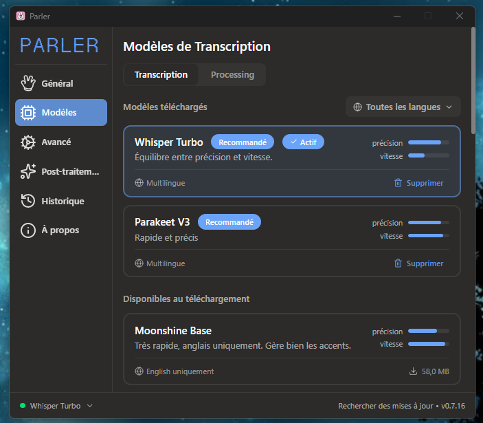
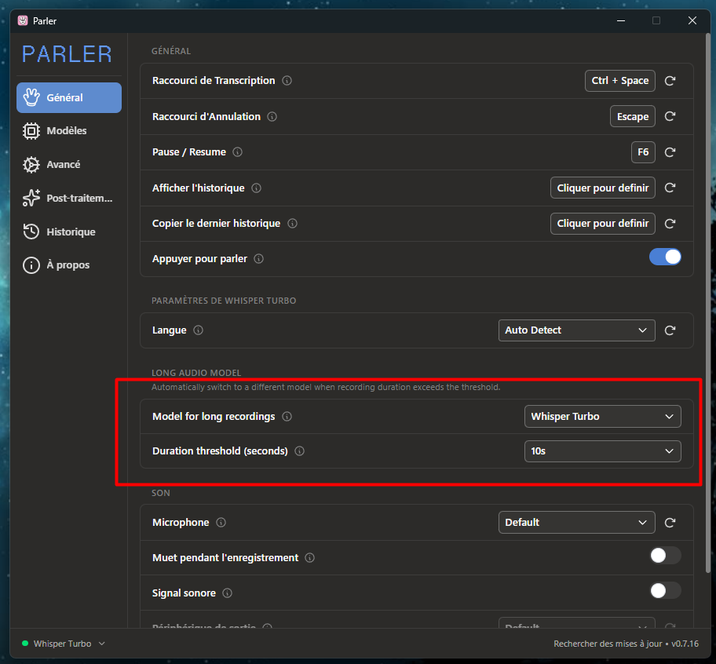
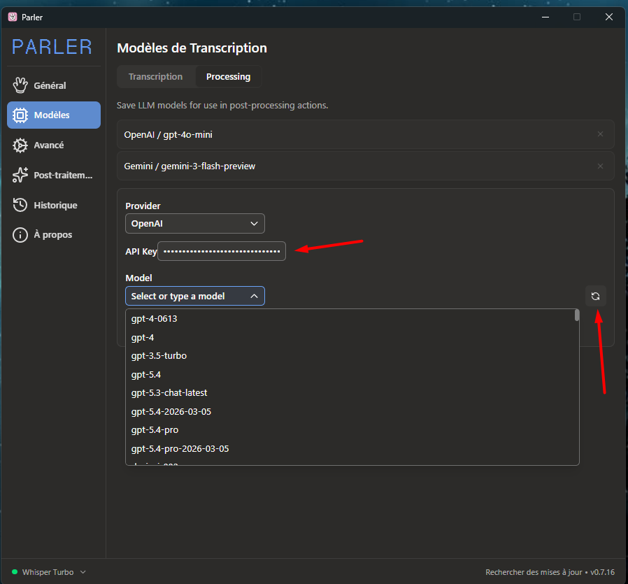
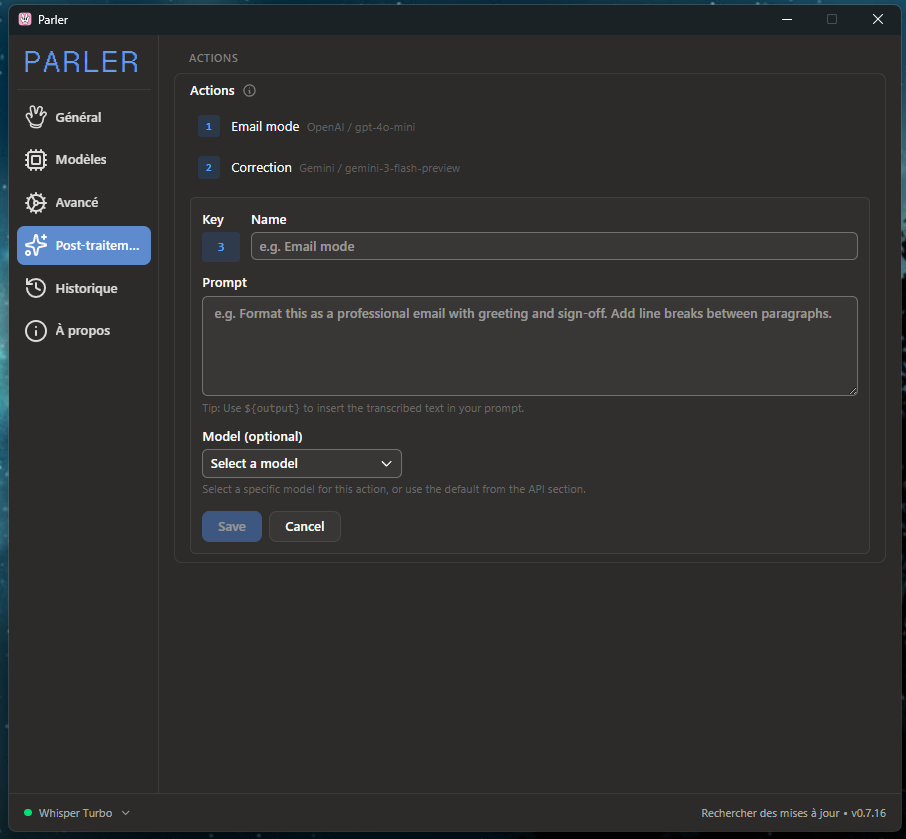
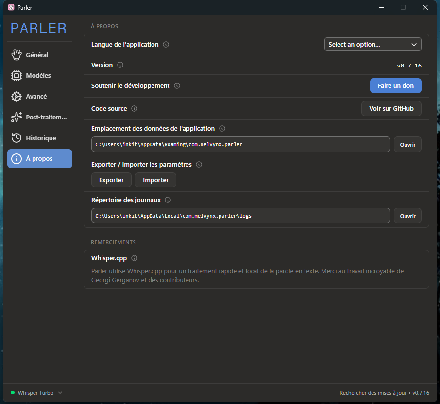

# Parler for Windows

Parler est, a mon avis, la meilleure application de dictee vocale qui existe. Et elle est totalement gratuite.

## L'histoire du projet

Le projet original s'appelle [**Handy**](https://github.com/cjpais/Handy), cree par **CJ Pais** -- une application desktop de speech-to-text qui tourne entierement en local sur votre machine (rien ne part dans le cloud).

[**Melvyn**](https://github.com/Melvynx) l'a ensuite forke sous le nom [**Parler**](https://github.com/Melvynx/Handy), en ajoutant des features majeures : systeme de post-traitement multi-providers (OpenAI, Anthropic, Groq...), actions numerotees, historique ameliore, overlay redesigne, et bien plus. Il l'a rendu pratiquement parfait -- mais sans version Windows.

Ce fork (`david-digitis/Parler`) reprend le travail de Melvyn et ajoute :
- **Un build Windows** (installeur `.exe` et `.msi`)
- **L'export/import des parametres** pour transferer sa config d'un PC a l'autre

---

## Installation

1. Telechargez le `.exe` depuis la page [**Releases**](https://github.com/david-digitis/Parler/releases)
2. Lancez l'installeur
3. **Attention** : Windows SmartScreen affichera un avertissement car l'application n'est pas signee. Cliquez sur **"Plus d'infos"** puis **"Executer quand meme"**.

---

## Configuration

Ce tuto est volontairement bref. Si vous utilisez des applications open source depuis GitHub, vous savez installer et configurer ce genre d'outil.

### Modeles de transcription

Les modeles tournent **en local** sur votre machine -- aucune donnee n'est envoyee vers le cloud.



- **Whisper Turbo** : recommande pour les longs messages, mais la transcription prend un peu plus de temps.
- **Parakeet V3** : parfait pour des phrases courtes et rapides.

#### Switching automatique selon la duree

C'est l'une des grosses ameliorations de Melvyn : Parler peut automatiquement basculer entre deux modeles selon la longueur de votre enregistrement.



Si votre enregistrement depasse le seuil configure, Parler passera sur Whisper Turbo (plus precis mais plus lent).

---

### Post-traitement (IA)

Le post-traitement utilise des **IA externes** via des cles API. Tous les principaux providers sont disponibles : OpenAI, Anthropic, Groq, Cerebras, OpenRouter, Gemini...

Il suffit d'entrer votre cle API et de cliquer sur "Refresh" pour voir les modeles disponibles.



Le post-traitement fait passer votre texte transcrit dans un prompt de votre choix. Ce que vous en faites ne tient qu'a votre imagination.

#### Actions (raccourcis numerotes)

Chaque action que vous creez est associee a un raccourci clavier. Vous pouvez en creer jusqu'a 9.



**Comment l'utiliser** : lancez la transcription avec le raccourci normal, puis appuyez sur `Ctrl + [numero]` de l'action souhaitee. Chaque action peut utiliser un modele different.

#### Exemples de prompts

**Mode Email** :

```
You are a voice transcription corrector. Take the following raw text and apply these fixes:

Punctuation: add periods, commas, question marks, and exclamation points where they belong.
Capitalization: fix capitals at the start of sentences and on proper nouns.
Line breaks: insert line breaks between distinct ideas or sentences to make the text clean and readable.
Misheard words: fix words that were badly transcribed by speech recognition, guessing the correct word from context.
Fillers: remove hesitations, repetitions, and filler words (um, uh, like, you know, so, basically, etc.).
Grammar: fix grammar, verb tenses, and agreement errors.
Contractions: restore natural contractions where appropriate (I am -> I'm, do not -> don't, etc.).

Strict rules:

NEVER rephrase or rewrite the meaning. Keep the author's original tone and natural speaking style.
Do NOT add any information.
Return ONLY the corrected text, with no comments or explanations.

Text to correct:
${output}
```

**Correction de texte** : meme prompt, adapte a votre besoin. Le `${output}` est remplace automatiquement par le texte transcrit.

---

### Export / Import des parametres

Fonctionnalite ajoutee dans ce fork. Permet de sauvegarder toute votre configuration dans un fichier JSON et de la reimporter sur un autre PC ou apres une reinstallation.



Les boutons se trouvent dans **About** (barre laterale). Cliquez sur **Export** pour sauvegarder, **Import** pour charger une configuration existante.

---

## Credits

- [CJ Pais](https://github.com/cjpais) -- createur original de Handy
- [Melvyn](https://github.com/Melvynx) -- fork Parler avec les features avancees
- [David / Digitis](https://github.com/david-digitis) -- build Windows et features supplementaires
